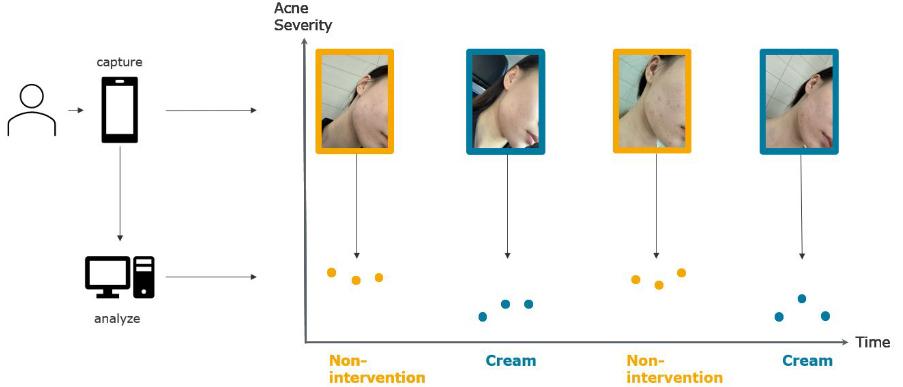
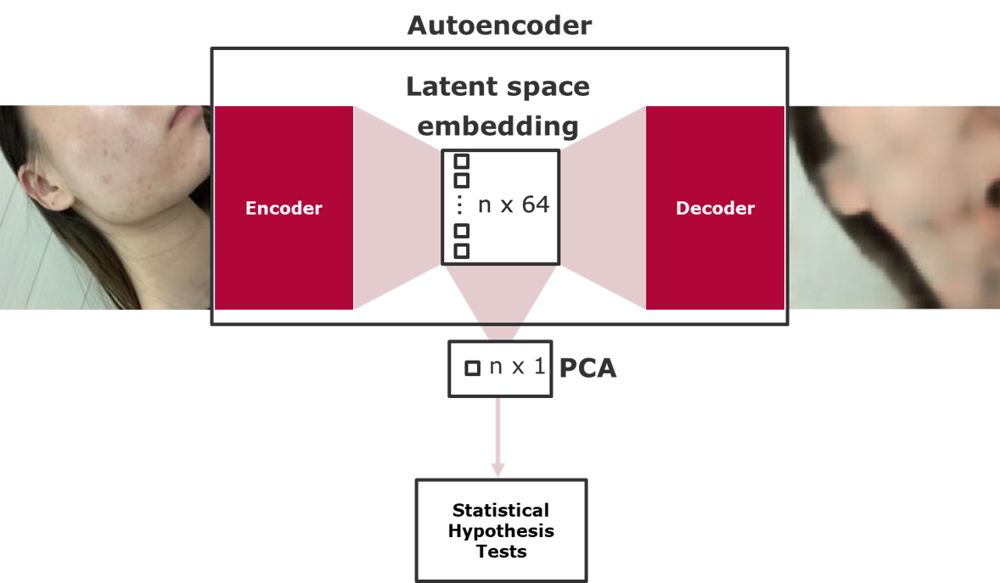

# Multimodal N-of-1

## Introduction to Multimodal N-of-1

This project is about investigating an analytic pipeline for analysing multimodal N-of-1 trials. N-of-1 trials can be seen as individualized multi-crossover trails, where you are investigating the effect of a treatment within a patient. By aggregating N-of-1 trials, you can also analyze them on a population level.

In a multimodal N-of-1 trial, we are investigating multimodal outcomes such as images for a trial. In the first demo, we are focussing on Images collected during a study of acne, where we investigating whether creme A or creme B improve the skin condition within 5 individuals. The data set was collected by students. [2]

## Methods

In the first trial, a deep-learning predicition model was trained on labeled data to show case, that deep learning could be used to analyse multimodal N-of-1 trials. [2] Nevertheless, the model needs to be trained on labeled data, which might not be avialabale for every study. So, we came up with an unsupervised approach for analysing the data. [1]

For that, we are training an Autoencoder on the data set to learn image representations and create a lower dimensional feature space. As this embedding space should capture information of the image, we are using them in the analysis step. For that, we further reduce the feature space by using the first principle component and use the value for statistcal hypothesis tests. With that, we are able to use statistical test routines developed over the last years, nevertheless, we are aware that multidemensional tests on the embedding as maximum mean discrepancy could be usefull as well.

## Code Base

The code base consists of many experiments conducted over the last month.

### Structure

- `code`: scripts for creating embeddings and calculating tests results.
- `src`: functionalities

To be set up by the user:
- `data_local`: With subfolders `Acne_Nof1_trial` and `Simulation` where acne pilot data and simulated data are stored, respectively.
-  `data_local/Acne_Nof1_trial` contains 5 subfolders for each study participant
-  `data_local/Simulation` contains subfolders structured as this: rad0_simulated_images, rad1_simulated_images, and so on. Each containing subfolders `no_effect/images`/`strong_effect/images` where the respective simulated images of the radius and effect type are stored.

### Tools and Software

We are using mainly:

- Python
- Pytorch

A set up tutorial, requirements file oder environment is not specified yet.

## Literature

1) Schneider J, Gärtner T, Konigorski S (2023). _Multimodal Outcomes in N-of-1 Trials: Combining Unsupervised Learning and Statistical Inference_. [arXiv:2309.06455](https://doi.org/10.48550/arXiv.2309.06455)
2) Fu J, Liu S, Du S, Ruan S, Guo X, Pan W, Sharma A, Konigorski S (2023). _Multimodal N-of-1 trials: A Novel Personalized Healthcare Design_. [arXiv:2302.07547](https://doi.org/10.48550/arXiv.2302.07547)